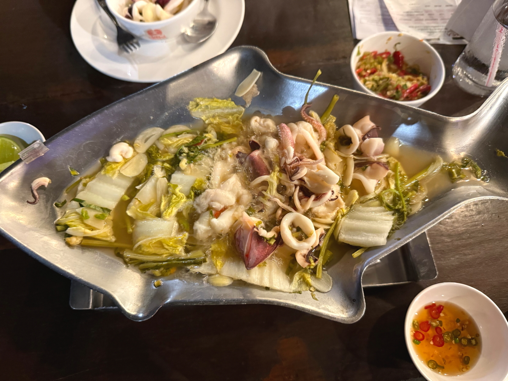
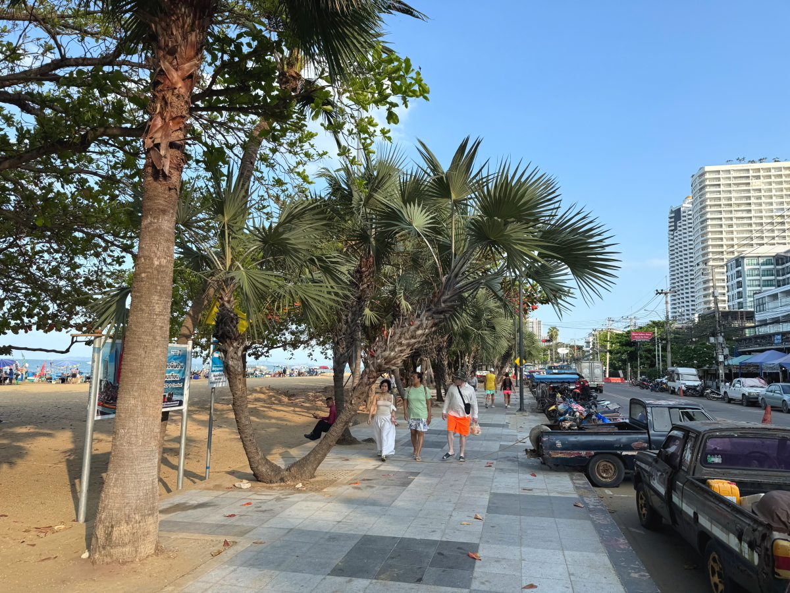
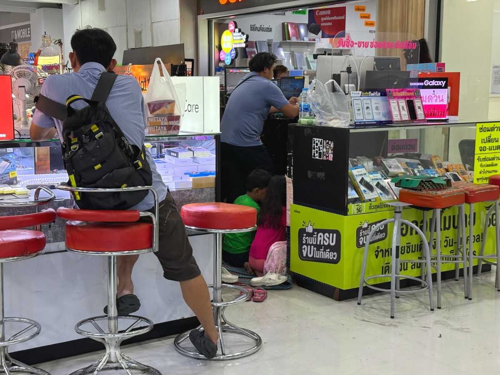

# 20250306_phattaya

<html>
<head>

<meta charset="UTF-8">
<meta http-equiv="Content-Type" content="text/html; charset=UTF-8">
<meta http-equiv="X-UA-Compatible" content="IE=EmulateIE10" />
<meta http-equiv="X-UA-Compatible" content="IE=edge">

<meta name="viewport" content="width=device-width, initial-scale=1.0">

<!--ここから上はお決まりの定型文です-->

<!--ここからが表現の書式などを決めるcssという部分-->

<link href="https://cdnjs.cloudflare.com/ajax/libs/lightbox2/2.7.1/css/lightbox.css" rel="stylesheet">

</head>

<body>

モバイル端末をお使いの場合は、画面を横向きにすると
より見やすくご覧頂けます。

<!--ここ上は、ほぼそのまま使います！-->

<!--QRコードの挿入例-->

 アクセス用QRコード

<marquee direction="left" scrollamount="20" width="30%">(^_^)/~alis</marquee>

<!--流れ文字の挿入例-->
<h1><marquee behavior="left">!!! 2025/03/06、パタヤからバンコクに移動して市内のショッピングモール!!!</marquee></h1>

                          

<!--ここから下が、本体部分-->

<h2>5日夜の取りこぼしから上げます 5日連続でいつもの海辺のレストラン</h2>

    
<h2>夜10時閉店ですが、8時過ぎでもこのレベル</h2>

    
<h2>夜間就労の子供が頑張ってます</h2>

    
<h2>英語による売り込み</h2>

    
<h2>売り込みに失敗してこちらのテーブルに流れてきました</h2>

    
<h2>お菓子３袋を100バーツで購入です、約440円</h2>

    
<h2>料理は味が完全に予想通りになるカニチャーハン</h2>

<h2>朝採れたてのイカの煮物</h2> 

    
<h2>ちょっと遅れて別の女の子が来ました・・・</h2>

<h2>もう買いませんでしたが、お店のお姉さんに怒られて可哀想だったので20バーツあげます</h2>

<h2>お空にはお月様、水平線にはイカ釣船の漁火</h2>

    
<h2>お月様の左下にはオリオン座が見事でした</h2>

    
<h2>最初の男の子のおねーちゃんが黙々と頑張ってます（茶色い服）</h2>

    
<h2>ここから6日の朝、宿の駐車場から見えた朝日</h2>

    
<h2>朝のパタヤビーチを見てからバンコクに移動します ビーチの看板で腕立て伏せする白人のおじさん</h2>

    
<h2>朝の8時前ですがけっこうな人出</h2>

    
<h2>浜では朝水揚げされたばかりの鮮魚の即売</h2>

    
<h2>浜のマンション群、屋上にも椰子の木が植ってます</h2>

    
<h2>水揚げのおこぼれを狙う水鳥</h2>

    
<h2>エビ２Kg購入で2000バーツ、約8800円をタイ版PayPayのQRコードで支払い</h2>

    
<h2>浜には鮮魚店がずらり</h2>

    
<h2>エビは出店のお父さんの口利きで、浜の食堂で煮てもらいます、調理代100バーツ</h2>

    
<h2>お店の前に止まってたバイク、珍しくディスクロックしてました</h2>

    
<h2>タイでは初めて見たかも・・・</h2>

    
<h2>浜辺のお花は皆綺麗ですね</h2>

    
<h2>落ち葉はやたらでかいので、箒ではかずに棒で刺して集めます</h2>

    
<h2>コンビニのアルコールは販売時間外でカバーされてました</h2>

    
<h2>高速でバンコクに移動、平日なので2時間ほどで着きました</h2>

    
<h2>市内の巨大ショッピングモールでは僧侶たちがApple製品を物色中</h2>

    
<h2>地上４階、地下１階の巨大売り場はどこに何がるのか全くわかりません</h2>

    
<h2>馴染みの日本ブランドもたくさん入ってました 画像クリックでGoogleMapsに飛びます↓</h2>

    
<h2>４階の一角は子供たちの遊園地みたいになってました</h2>

    
<h2>タイの学校は休みに入っているので、日中から子供達が来てます</h2>

    
<h2>地下にはかなりマニアックなPC系の部品屋さん</h2>

    
<h2>このグラボのニーズがあるとは、さすがバンコク</h2>

    
<h2>顕微鏡覗きながら半田付けするお兄さん</h2>

    
<h2>部品や中古品売り場は子育てしながらの商売</h2>

    
<h2>中古品のグラボもショーケース内に並びます</h2>

    
<h2>ディスクトップのフラッグシップらしき筐体、スペック聞いたら店員さんも知らず</h2>

    
<h2>1階のイベント広場では各社一斉に販促活動、Hondaも Toyotaも同席</h2>

    
<h2>本屋さんではタイ語と英語の本が半々くらいでした</h2>

    
<h2>金のお店も大きくて、腰に銃さした警備員が2人で談笑中</h2>

    
<h2>中央のイベント広場は子供達で大盛況、風船乗りは長蛇の列</h2>

    
<h2>4階まで上がって、イベント広場見下ろしながらの昼食</h2>

    
<h2>巨大ショッピングモールなので仏壇も綺麗でした</h2>

<!--   
  
<h2>今日のBGMは 移動で疲れたので癒し系 【120万再生感謝🌙】聴き流すだけで奇跡が起きる… 月のカノン</h2>
<iframe width="560" height="315" src="https://www.youtube.com/embed/lJxdEHg9cqA?si=6vr6iynbUdvMm-gF" title="YouTube video player" frameborder="0" allow="accelerometer; autoplay; clipboard-write; encrypted-media; gyroscope; picture-in-picture; web-share" referrerpolicy="strict-origin-when-cross-origin" allowfullscreen></iframe> 
-->

<!--
  
<h2>メタバース「cluster」内のイベントで「雪の約束」by まいてゃさん ダンサーの玖遠さんがトラブってみんなでステージダンスになりました</h2>
  
        <h2>MP4ファイルの再生</h2>
    <video controls width="640">
        <source src="2025-02-26 yukinoyakusoku by maitiya.mp4" type="video/mp4">
        お使いのブラウザは video タグをサポートしていません。
    </video>
-->

  
<h2>まいてゃさんアルバム MBG 2502 10kyoku 再掲です</h2>
<iframe width="560" height="315" src="https://www.youtube.com/embed/xVTSe-eXbFs?si=1YAnLelZqsU-zs0m" title="YouTube video player" frameborder="0" allow="accelerometer; autoplay; clipboard-write; encrypted-media; gyroscope; picture-in-picture; web-share" referrerpolicy="strict-origin-when-cross-origin" allowfullscreen></iframe> 
    
    
    <h3>「雪の中で輝くシンデレラ」by まいてゃ</h3>
<h2><a href="https://torokoid.github.io/20250219_chiangrai/maitiyaz.mp3" target="_blank">この文字クリックで再生します 下の再生ボタンでも同じ曲をループ再生します</a></h2>

    <audio controls loop>
        <source src="https://torokoid.github.io/20250219_chiangrai/maitiyaz.mp3" type="audio/mpeg">
        お使いのブラウザは audio タグをサポートしていません。
    </audio>

    
<!--
  
<h2>スティーブ・ジョブズの伝説の講義</h2> 
<iframe width="560" height="315" src="https://www.youtube.com/embed/XsRpvWHIVw0?si=f7IA0pv9iZWVk3VH" title="YouTube video player" frameborder="0" allow="accelerometer; autoplay; clipboard-write; encrypted-media; gyroscope; picture-in-picture; web-share" referrerpolicy="strict-origin-when-cross-origin" allowfullscreen></iframe>    
    
    
<h2>スティーブ・ジョブズ氏の講義の内容が「笑って死ぬ」by まいてゃ さんの歌の内容と大筋で同じに聞こえます 以下に再掲しますね</h2>

    
<h3>歌の後半部分しか撮れてませんが、2月16日のイベントで公開された「笑って死ぬ」 by まいてゃ 白ドレスはダンサーの玖遠さん、黒いドレスがまいてゃさん</h3>
<iframe width="560" height="315" src="https://www.youtube.com/embed/s4ZcbxAluMM?si=Xa32xo19UCNaWv0v" title="YouTube video player" frameborder="0" allow="accelerometer; autoplay; clipboard-write; encrypted-media; gyroscope; picture-in-picture; web-share" referrerpolicy="strict-origin-when-cross-origin" allowfullscreen></iframe> 
-->
    

    <h3>お気に入りの「笑って死ぬ」 by まいてゃさんも再々掲です</h3>
<h2><a href="https://torokoid.github.io/20250221_chiangrai/maitiya3.mp3" target="_blank">この文字クリックで再生します 下の再生ボタンで同じ曲をループ再生します</a></h2>

    <audio controls loop>
        <source src="https://torokoid.github.io/20250221_chiangrai/maitiya3.mp3" type="audio/mpeg">
        お使いのブラウザは audio タグをサポートしていません。
    </audio>

   
<h2>以上、パタヤからバンコクに移動してショッピングモールで過ごしました。 ここまでご覧いただきありがとうございました。</h2>

     
<h2>
<a href="https://torokoid.github.io/20241126_chiangrai/" target="_blank">Back to the menu page</a>
</h2>

   

         

  

      

<!--本体はここまで-->

<!--画面に空白地帯を作って、背景が見えるようにしています-->
                                              

<!-- フッタ -->
<footer>

Copyright 2025/03/06 alis @ChiangRai

</footer>

<!--HPにさまざまなJavaScriptを呼び込むための書式-->

    
    </body>
    
</html>
